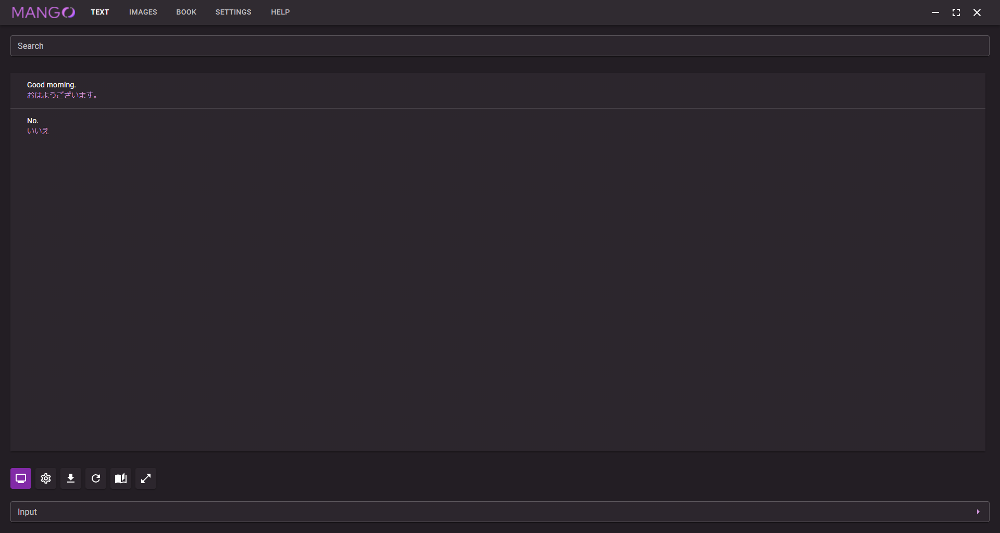
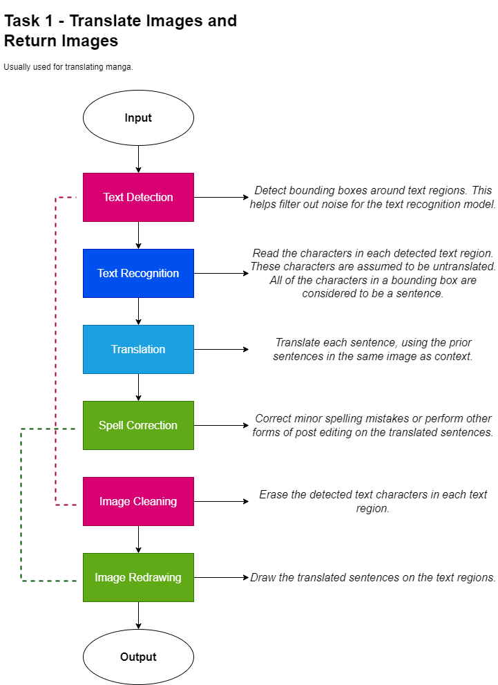
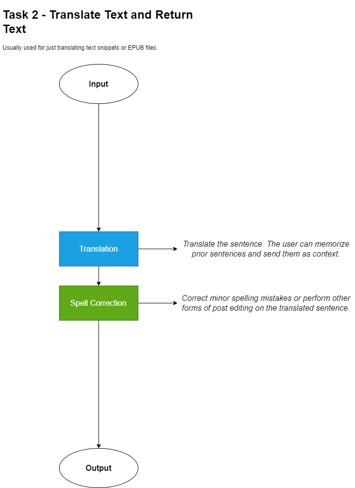
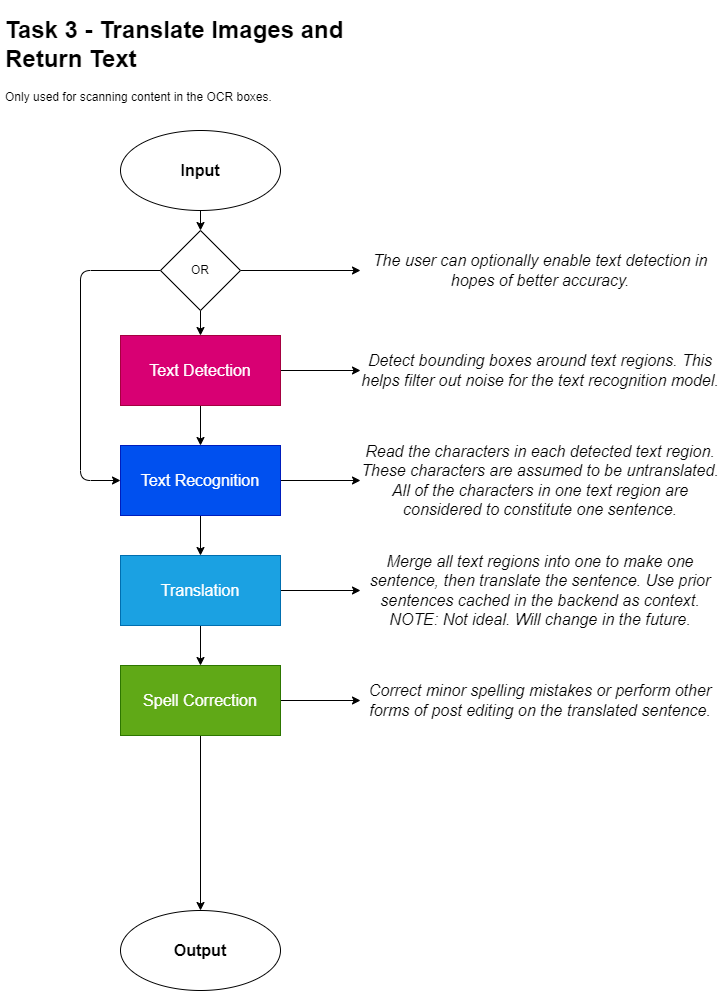

# About
- [What can this app do?](#what-can-this-app-do)
- [System requirements](#system-requirements)
- [How do I install this?](#how-do-i-install-this)
- [Model packs for installation](#model-packs-for-installation)
- [Model types](#model-types)
- [What's the catch?](#whats-the-catch)
- [Where are the output files saved?](#where-are-the-output-files-saved)
- [Visualizing the pipeline](#visualizing-the-pipeline)
- [Where did you get the data to train some of these models?](#where-did-you-get-the-data-to-train-these-models)
- [Thanks to...](#thanks-to)

**Mango-Mandy+Gandy** is a fully automated tool to machine translate text, manga, games, and ebooks. It comes with a bunch of models tuned in house as well as a basic UI to easily use them.

:warning: CURRENTLY IN ALPHA - Expect a bunch of bugs and just general unwieldiness. :warning:

# What can this app do?

I built Mango for basic text-to-text translation, but it can be used for other things too:

- :page_facing_up: Image translation, mainly tuned for **manga**. Currently supports a few basic inpainting methods.
- :video_game: Game translation, using Textractor or the built in OCR engine. Do note that the OCR engine was *not* tuned for images in games and may not function as well as compared to Textractor.
- :orange_book: EPUB translation, for reading light novels.

Mango also has basic support for Chinese-English and Korean-English.

On top of that, **all of these models are downloaded locally - no need to worry about rate limits.**

Lastly, all of these models were trained or tuned by me, and I'll probably continue to tune them as time goes on. See details on the models below.

# System requirements

1. A decent CPU and ~4gb RAM.
2. Windows 10 or higher (may work with older windows. Not sure.)
3. ImageMagick

# How do I install this?

1. Install ImageMagick.
2. Download the prebuilt Mango application [here](https://github.com/SmartWashingMachine/Gandy/releases/).
3. Download the "Jap2Eng Starter" model pack [here](https://drive.google.com/file/d/1F_-YTbDAvpjPTazniIgNtQZKcRv4fLYC/view?usp=share_link), and drag the "models" folder to the same folder that Mango.exe is located in. If you want more functionality, download some of the model packs below.
4. Run mango.exe!

*Models will not work if the corresponding model pack is not installed.*

# Model packs for installation

- [Jap2Eng Starter](https://drive.google.com/file/d/1F_-YTbDAvpjPTazniIgNtQZKcRv4fLYC/view?usp=share_link) - Only supports base Japanese to English translation. Only allows the DETRG text detection model (default models). **At minimum, you need this package.**
- [Chinese Lite](https://drive.google.com/file/d/10nse2-1Tp-Hv4PIFHtGaRH0n3G_9cDbQ/view?usp=share_link) - Adds support for Chinese translation.
- [Korean Lite](https://drive.google.com/file/d/1JjiATtHGdnJzUU2Q_xK6hgJu6y6Tq-oO/view?usp=share_link) - Adds support for Korean translation.
- [Text Things](https://drive.google.com/file/d/1bap2jNkXNwM01MXYlzwypIKzgAc0fv-3/view?usp=share_link) - Adds support for RCNN and DETR-VN text detection models.
- [Inpainting](https://drive.google.com/file/d/1BCq9CHgwprcF9syPDltX2w7nwYKV28d4/view?usp=share_link) - Adds support for AI inpainting. Experimental.
- [DocRepair](https://drive.google.com/file/d/1mWtpRRxPZ_JyiKfJ6yWm5-2ljed7g_ES/view?usp=share_link) - Adds support for DocRepair. Experimental.
- [Jap2Eng Neighbor](https://drive.google.com/file/d/1S8yRCjuRJ_Z5RY9tNtxobkjichL54Tks/view?usp=share_link) - Adds a stronger translation model. Experimental.

To install a package, simply unzip the file and drag the "models" folder to the same folder that mango.exe is located in.

Make sure the app is closed while doing this!

# Model types

Currently, Mango comes with several different models trained for different purposes.

These include:

- Text detection, including a Faster-RCNN model as well as a Detection Transformer model.
- Text recognition, including TrOCR models. I've found them to work much better than CNN models on this task.
- Translation, including OPUS models from huggingface. I finetuned them to try and utilize contextual info from prior input sentences with a contextual loss function. The base translation model was also configured to use position info more effectively - techniques I've found critical to deter neural text degeneration.
- Image inpainting, using a basic EfficientNet text segmentation model as well as an EdgeConnect model finetuned for anime styled images. I modified the EdgeConnect decoder to use residual blocks as well as nearest neighbor upsampling. Still kinda sucks though.
- Post editing, using pretrained BERT models finetuned to correct text with contextual info. This feature is still a work in progress.

# What's the catch?

Mango is currently in alpha and I'm only really working on this in my free time. Here are a few things to note and improve on in the future:

1. Does not support proper GPU usage yet. Attempting to use the GPU with DirectML will likely fail on most machines.
2. Machine translation needs more work. Sometimes it overuses the contextual info. Need to somehow integrate speaker information. Also need to work on it's capability to translate names.
3. Text detection is not as accurate as I'd like it to be. I don't have many images to train it with...
4. Image inpainting is very basic right now.
5. Can be a pain to install.
6. Text recognition model could use more tuning.
7. Buggy.
8. Chinese-English and Korean-English models are still very limited.
9. Code is messy. I'll clean it up in the future... maybe. Technical debt is real.
10. Disable full logging. Will disable once I fix a few more bugs.
11. Need to do a lot of work on the typesetting.

# Where are the output files saved?

All output files (translated books, saved backlog text files, and translated images) as well as error logs should be saved in the "Mango" folder under Documents.

# Visualizing the pipeline

# Where did you get the data to train some of these models?

;)

# Thanks to...

[Helsinki NLP](https://huggingface.co/Helsinki-NLP) - For their awesome tools, datasets, and models that they've made publicly available. Mainly used [OpenSubtitles](https://opus.nlpl.eu/OpenSubtitles.php)

[Transformers](https://github.com/huggingface/transformers) - Borrowed a lot of their code for generation logic.

[Manga OCR repo](https://github.com/kha-white/manga-ocr) - Had to modify their dev script quite a bit for internal usage, but the general premise of using HTML2Image is ingenious. That's way better than manually drawing it with PIL. Also used it to make synthetic text masks for the text segmentation model.

[EdgeConnect](https://github.com/knazeri/edge-connect) - Having to train an image inpainting model from scratch is a *massive* pain. Their pretrained checkpoints + general methodology was the best performing inpainting solution I could find. (no, we don't talk about stable diffusion - that's way too slow for this task)

[P-transformer](https://arxiv.org/abs/2212.05830) - Simple to implement and very strong. One of the few tricks that seem to work in this domain.

[Focused Concatenation](https://arxiv.org/abs/2210.13388) - A great trick to improve document MT performance.

[DocRepair](https://arxiv.org/abs/1909.01383) - Sometimes it works really well and sometimes it fails horribly, but either way it's really cool. CADec gave me nightmares.

*And many others...*
